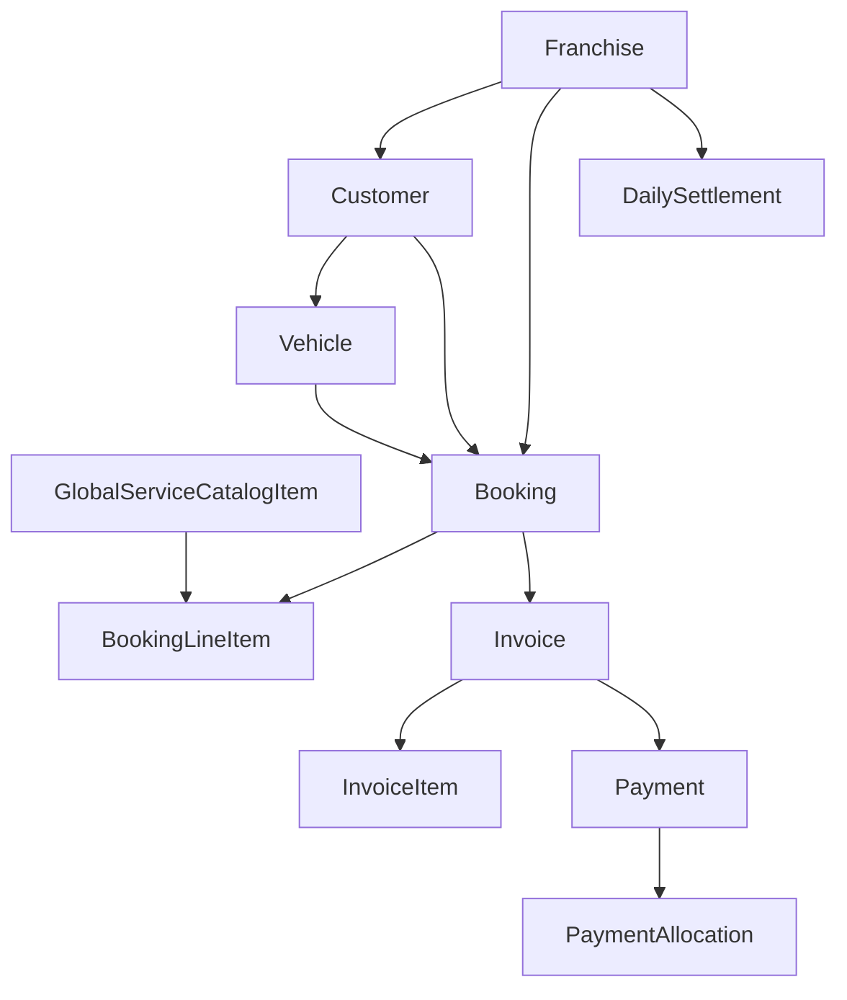

# Data Model Overview

## Tenancy

All operational records are scoped by franchise:

- `franchises`
- `users`
- `customers`
- `vehicles`
- `services`
- `bookings`
- `invoices`
- `payments`
- `daily_settlements`
- `audit_logs`

## Core Relationships

## Finance Integrity Rules

- invoice numbering is generated per franchise and invoice type through `invoice_sequences`
- GST and non-GST invoices are represented by `invoice_type`
- bookings are registered before the invoice exists
- the first recorded payment for a booking generates the invoice
- invoice totals are stored as finalized numbers, not recomputed implicitly later
- `payments` are immutable records
- `payment_allocations` preserve how money was attached to an invoice
- `daily_settlements` store closed-day snapshots rather than mutable counters
- `franchise_commission_policies` stores commission history with `effective_from`

## Access Control Model

- `users` can belong to a franchise
- `user_roles` and `role_permissions` define capability sets
- franchise admins and staff operate inside their assigned franchise
- main admin users are granted cross-franchise visibility through role policy

## Suggested Migration Order

1. tenancy and auth tables
2. customer and catalog tables
3. bookings and invoices
4. payments and allocations
5. settlements and audit logs
